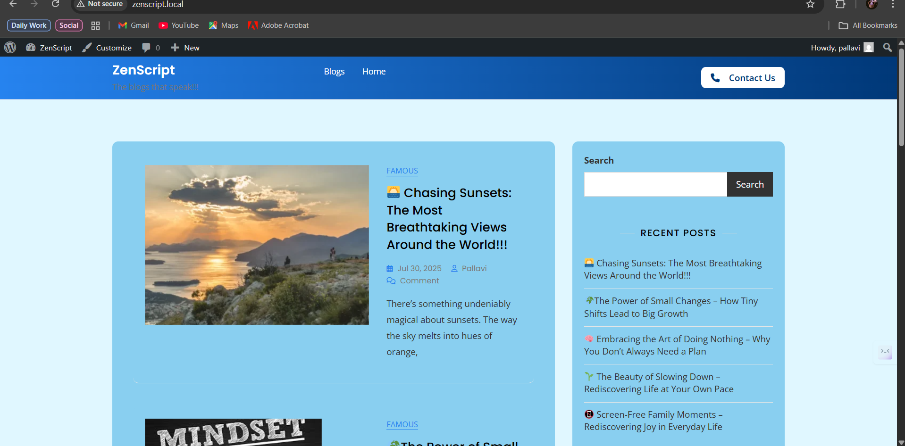
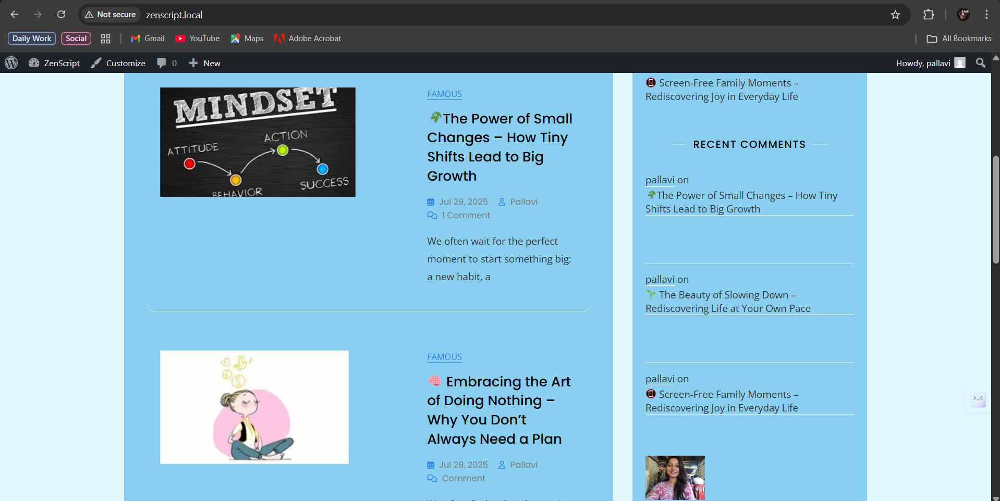
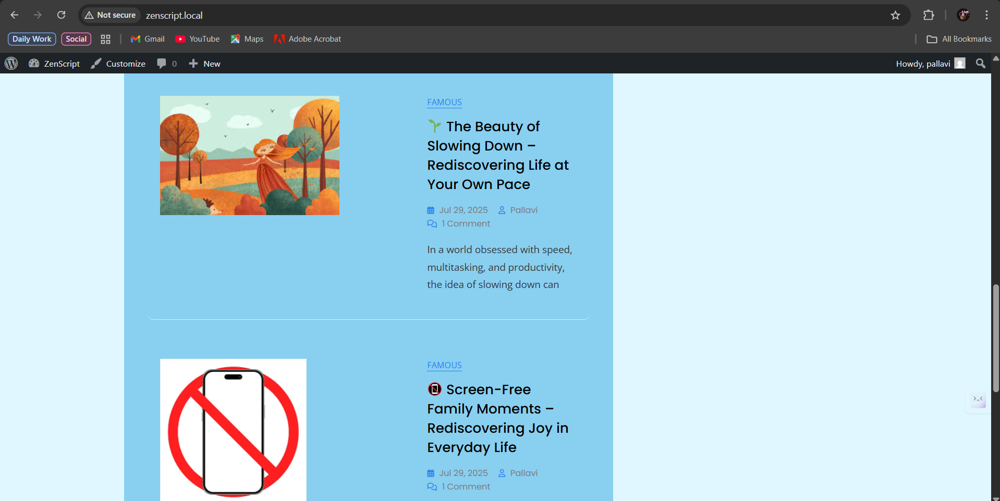
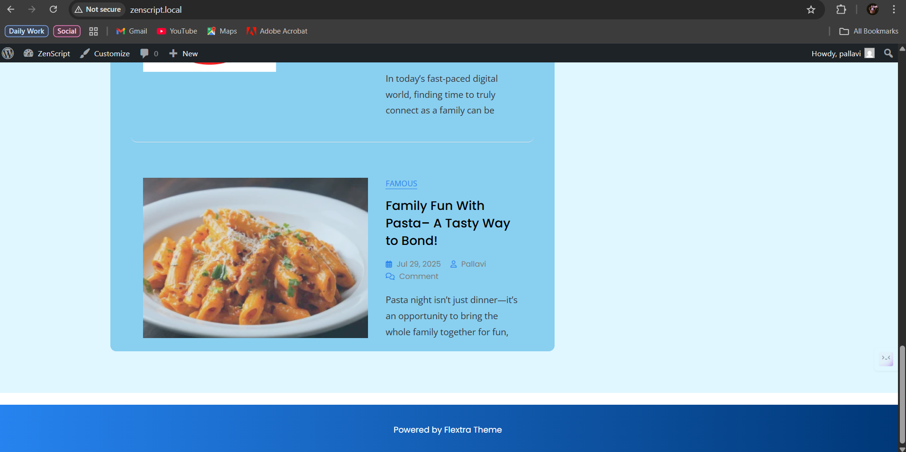
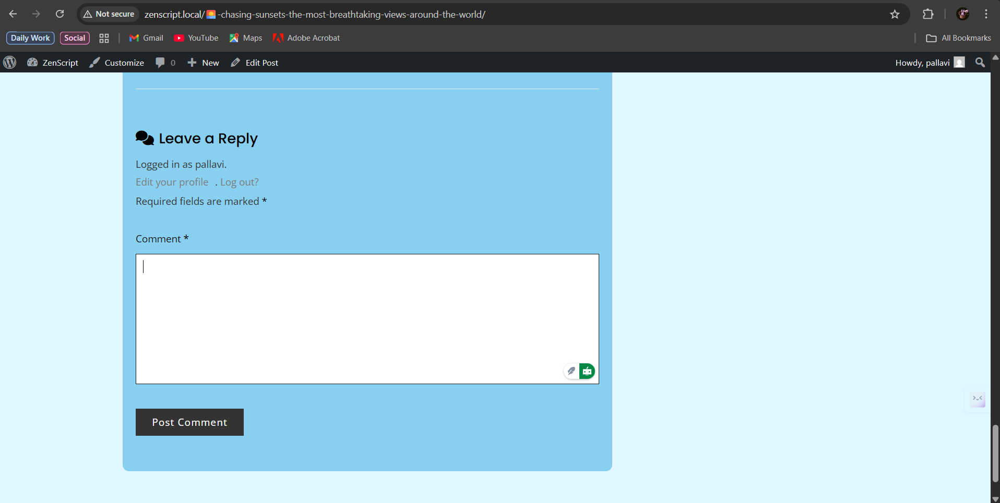
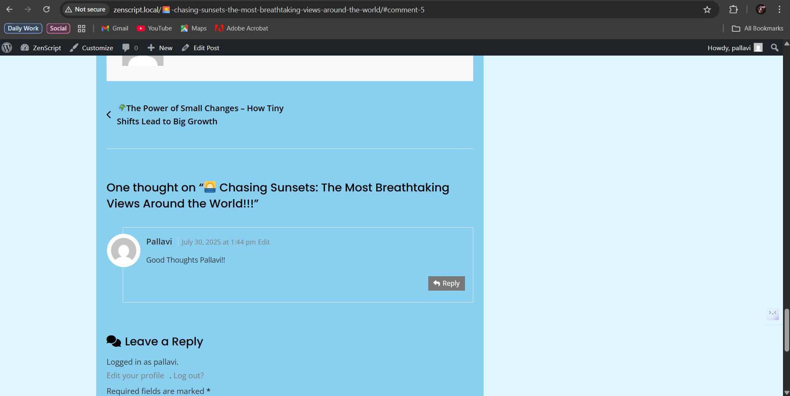

# 🌐 Zenscript Blogs — WordPress

Zenscript Blogs is a **WordPress-powered blogging project** created to provide a clean, modern, and responsive blogging experience.  
This repository contains the WordPress setup along with custom themes, plugins, and configurations that power **Zenscript Blogs**.

---

## 📖 About the Project

Zenscript Blogs is designed to be a **personal / professional blogging platform** using WordPress as the CMS.  
It demonstrates the integration of themes, plugins, and configuration for a fully functional blog.  

Goals of this project:
- To practice **WordPress development & customization**  
- To provide a **ready-to-use blogging system** for personal or demo use  
- To learn and showcase **deployment & Git version control with WordPress**  

---

## 📸 Screenshots




---


---


---


---


---


---


## 🚀 Features
- 📝 **Clean & Responsive Theme** – optimized for desktop and mobile  
- ⚡ **SEO Friendly** – easy integration with SEO plugins  
- 🎨 **Custom Theme Support** – modify or add new WordPress themes  
- 🔌 **Plugin Integration** – extend functionality (contact forms, SEO, caching, etc.)  
- 🔒 **Security Ready** – excluded sensitive files via `.gitignore`  
- 📂 **Organized Codebase** – themes, plugins, uploads, and core separated properly  

---

## 🛠 Tech Stack
- **Frontend**: WordPress Themes (PHP, HTML, CSS, JS)  
- **Backend**: WordPress Core (PHP, MySQL)   
- **Version Control**: Git + GitHub  

---

## 📂 Project Structure
```text
Zenscript-Blogs--WordPress/
│
├── wp-admin/            # WordPress admin core
├── wp-content/
│   ├── themes/          # Custom theme(s)
│   ├── plugins/         # Installed plugins
│   └── uploads/         # Media files (ignored in Git)
│
├── wp-includes/         # WordPress core libraries
├── wp-config.php        # WP configuration (ignored in Git)
├── .gitignore
└── README.md
